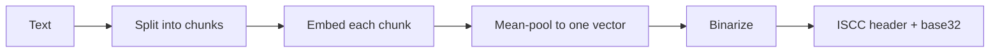

# How it works

This page explains how a Semantic Text-Code is built and why semantically similar texts — including
translations — produce codes with low Hamming distance.

## The problem

The standard ISCC Content-Code for text matches on lexical similarity: it compares the words that
appear in a document. That works well for near-duplicates, but it cannot tell that a German
translation carries the same meaning as its English original — the two share almost no words.

The Semantic Text-Code targets meaning instead of wording. It is built so that texts about the same
thing land close together in code space, whatever language they are written in.

## The pipeline

Each stage has a specific job.

### Split

A document is first split into overlapping chunks at sensible boundaries (up to 127 tokens each,
with up to 48 tokens of overlap). Overlap keeps a sentence that straddles a boundary from being lost
to both chunks.

Text without regular paragraph breaks — such as text extracted from print-layout PDFs — takes a
guarded code path that produces the same chunks without the super-linear cost the naive splitter
would incur on those inputs.

### Embed

Each chunk is run through a multilingual sentence-transformer model
([paraphrase-multilingual-MiniLM-L12-v2](https://huggingface.co/sentence-transformers/paraphrase-multilingual-MiniLM-L12-v2))
exported to ONNX. The model turns a chunk into a 384-dimensional embedding: a vector of numbers that
encodes the chunk's meaning. The model was trained so that texts with similar meaning — across more
than 60 languages — map to nearby vectors.

The per-token outputs are combined into one chunk vector by attention-mask pooling, then normalized.

### Aggregate

The chunk vectors are averaged into a single document vector and normalized again. This is the one
vector that represents the whole document's meaning.

### Binarize

Each component of the document vector becomes one bit: positive values become `1`, the rest become
`0`. The full vector yields a 384-bit digest.

The digest is truncated to the requested length (`bits`, up to 256), prefixed with a 2-byte ISCC
header that marks it as a Semantic Text-Code, and encoded as base32 with the `ISCC:` prefix.

## Why binarized vectors still match

Two texts with similar meaning produce similar embeddings — vectors pointing in nearly the same
direction. Nearly-aligned vectors agree on the sign of most of their components, so their bit
patterns agree on most bits, giving a low Hamming distance.

Unrelated texts produce roughly perpendicular vectors, which agree on only about half their signs —
so their codes differ in about half their bits. That gap between "few bits differ" and "about half
the bits differ" is what makes a similarity threshold meaningful.

| Property          | Behavior                                                |
| ----------------- | ------------------------------------------------------- |
| Similar meaning   | Few differing bits (low Hamming distance)               |
| Unrelated content | About 50% of bits differ                                |
| Translation       | Treated like similar meaning — a near-match             |
| Longer `bits`     | Wider spread between near-matches and unrelated content |

`iscc_distance()` measures similarity by stripping the `ISCC:` prefix and the 2-byte header, then
counting the differing bits between the two code bodies. `cosine_similarity()` rescales that
distance to a `-100`–`+100` score. See [comparing texts](../howto/compare-texts.md).

## Cross-lingual matching

Cross-lingual matching is a direct consequence of the embedding model. Because the model was trained
to place a sentence and its translation near each other in vector space, the document vectors stay
close, the sign patterns stay mostly equal, and the codes stay a few bits apart.

No machine translation happens at code time. The shared meaning is captured once, by the model,
during embedding.

## Granular features

Alongside the document code, `iscc-sct` can emit a simprint for each chunk. Because chunks carry
their offsets, you can locate matching passages within documents and align similar passages across
two documents — even when they sit at different positions. See
[granular features](../howto/granular-features.md).

## Relation to the ISCC standard

The Semantic Text-Code is a planned, experimental ISCC-UNIT (MainType SEMANTIC, SubType TEXT). It is
a proof of concept and **not** part of [ISO 24138:2024](https://www.iso.org/standard/77899.html).
The codes it produces may change between releases below v1.0.0.

The codes are still structurally compatible with the ISCC framework: a standard 2-byte ISCC header
identifies the unit type and length, so a Semantic Text-Code slots in alongside the other
ISCC-UNITs.

## Further reading

- **[Getting started](../tutorials/getting-started.md)** — Try the pipeline hands-on.
- **[Compare texts](../howto/compare-texts.md)** — Use the distance in practice.
- **[For Coding Agents](../reference/for-coding-agents.md)** — The exact algorithm, constants, and
    invariants.
